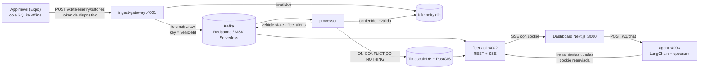

# Fleet Telemetry

MVP de un portal de monitoreo de flotas, construido para la prueba técnica *Senior Fullstack — Telemetría y Desarrollo Agéntico Extremo*.

La prueba evalúa el *cómo*: las decisiones de arquitectura, la auditoría y corrección de la IA, y la infraestructura. Este README sigue ese orden.

## 1. Qué es

Una app móvil offline-first captura posiciones GPS y las sincroniza por lotes idempotentes. El backend las ingiere por un bus de eventos, las persiste en TimescaleDB + PostGIS y alimenta un dashboard en tiempo real por SSE. Un agente LangChain responde preguntas en lenguaje natural ("¿qué vehículos llevan detenidos más de 20 minutos en zonas críticas?") con herramientas tipadas y detrás de un circuit breaker.



| Pieza | Responsabilidad |
|---|---|
| `packages/contracts` | Esquemas zod 4 compartidos: única fuente de verdad de eventos, DTOs, ACK, SSE y herramientas del agente |
| `packages/platform` | Fábricas de infraestructura: Kafka, Postgres, config, logger, migraciones y sesión |
| `services/ingest-gateway` | Autentica el dispositivo, valida cada punto, publica en `telemetry.raw` y manda los rechazos a la DLQ. El ACK solo sale cuando Kafka confirmó |
| `services/processor` | Persiste de forma idempotente, calcula detención y zonas, emite alertas y publica el estado |
| `services/fleet-api` | Sesión por cookie, read model REST, stream SSE y vinculación de dispositivos |
| `services/agent` | Agente LangChain con 3 herramientas de solo lectura y circuit breaker hacia fleet-api |
| `apps/web` | Dashboard con mapa MapLibre, KPIs, alertas en vivo y chat |
| `apps/mobile` | App del conductor: GPS en segundo plano, cola SQLite y sync por lotes |
| `tools/` | Seed, tokens de dispositivo, simulador de 30 vehículos y medición de persistencia |
| `infra/` | Docker Compose, migraciones, k6 y Terraform de AWS |

## 2. Cómo correrlo en local

**Requisitos:** Node 24 (`.nvmrc`), pnpm 12 y Docker Desktop. Para el móvil, además, Android SDK con un AVD y Maestro.

```bash
cp .env.example .env
# Completa en .env:
#   SESSION_SECRET     → 32 bytes o más
#   ANTHROPIC_API_KEY  → una clave de un workspace de Anthropic, para el agente real

docker compose up -d --wait            # Redpanda + TimescaleDB, con los tópicos creados
pnpm install --frozen-lockfile && pnpm build
pnpm db:migrate && pnpm db:seed        # migraciones, 2 tenants, 30 vehículos, zonas y usuarios
pnpm dev                               # gateway :4001, processor, fleet-api :4002, agent :4003, web :3000
pnpm simulate                          # 30 vehículos en Bogotá y Medellín
```

**Uso:**
- Abre `http://localhost:3000` y entra como `operador@norte.test` u `operador@sur.test`, con la contraseña `SEED_USER_PASSWORD` de tu `.env`.
- En segundos el simulador deja dos vehículos por tenant detenidos más de 20 minutos en una zona crítica, uno con ubicación simulada y uno que deja de reportar.
- La columna lateral tiene paneles desplegables que recuerdan si los dejaste abiertos o cerrados, y cada uno muestra su contador aunque esté cerrado:
  - **Resumen.**
  - **Alertas en vivo:** las resueltas quedan agrupadas en un historial.
  - **Detenidos.**
  - **Vehículos:** se abre solo al seleccionar un vehículo en el mapa.
  - **Zonas:** con "Nueva zona" dibujas el polígono en el mapa (o agregas puntos en el centro con el teclado) y le pones nombre y tipo.
  - **Vincular dispositivo:** generas el código para un vehículo del catálogo, o con "Nuevo vehículo" (placa y nombre) creas el vehículo y su código en un solo paso.
  - **Usuarios:** quién tiene acceso a tu flota.
- El botón "Asistente IA" abre el chat con el agente.

**Sistema completo en contenedores:** `docker compose --profile app up -d --wait`. Incluye `migrate`, `ingest-gateway`, `processor`, `fleet-api`, `agent` y la web (<http://localhost:3000>). Las `NEXT_PUBLIC_*` de la web se fijan al compilar la imagen (por defecto apuntan a `localhost:4002` y `localhost:4003`): para otro origen hay que reconstruirla con `--build-arg`.

**App móvil:**
- El development build sale de `pnpm --filter @fleet/mobile exec expo run:android`. En Windows, la compilación nativa falla con rutas de más de 260 caracteres.
  - Con pnpm no basta `subst`: compila desde una copia de trabajo en una ruta corta, por ejemplo `git worktree add --detach C:/ft develop`, seguido de `pnpm install` allí.
- En un celular físico por USB, con la depuración USB activada, redirige los puertos y apunta la app a `localhost`:
  - redirige los puertos con `adb reverse tcp:4001 tcp:4001` y `adb reverse tcp:4002 tcp:4002`;
  - compila con `APP_VARIANT=development EXPO_PUBLIC_INGEST_URL=http://localhost:4001 EXPO_PUBLIC_FLEET_API_URL=http://localhost:4002`.
  - En el emulador, las URLs por defecto (`10.0.2.2`) ya funcionan.
- Para vincularla: en el dashboard, en "Vincular dispositivo", elige o crea el vehículo, genera el código de un solo uso y tecléalo en la app.

**Verificación:**

```bash
pnpm typecheck && pnpm lint && pnpm test   # unitarios, sin red ni base
pnpm test:integration                      # adaptadores contra TimescaleDB y Redpanda reales
pnpm test:e2e                              # el arnés levanta los servicios en puertos propios
pnpm db:status                             # migraciones aplicadas y pendientes
```

## 3. Decisiones clave

Cada decisión tiene su ADR en [`docs/adr/`](docs/adr/).

| ADR | Decisión |
|---|---|
| [001](docs/adr/001-stack.md) | TypeScript de punta a punta sobre Node 24, frente a Go y .NET, con un único contrato zod para HTTP, Kafka, SSE, móvil y herramientas del LLM. kafkajs, con salida documentada a `@confluentinc/kafka-javascript` |
| [002](docs/adr/002-persistencia-timescaledb-postgis.md) | Persistencia en TimescaleDB + PostGIS frente a Cassandra, y por qué no Druid. Medido con 12 M filas ([evidencia](docs/evidence/persistence.md)): se escanea 1 de 15 chunks, la compresión es de 5x, el continuous aggregate es 62x más rápido que la consulta cruda y la ingesta llega a ~40 000 filas/s en un nodo |
| [003](docs/adr/003-monorepo-y-migraciones.md) | Monorepo con Turborepo y migraciones **reversibles**: par up/down obligatorio, checksum de los dos archivos, prueba de ida y vuelta contra un baseline del esquema y `db:rollback` solo contra una base marcada como local |
| [004](docs/adr/004-base-de-servicios-y-esquema-de-telemetria.md) | Hypertable con chunks de 1 día, compresión a los 7 días y retención de 90 (Ley 1581); índice único `(event_id, recorded_at)`; token de dispositivo opaco guardado como hash; readiness frente a liveness |
| [005](docs/adr/005-persistencia-de-telemetria-en-el-processor.md) | Commit de offsets por tramo, solo después de persistir. **A la DLQ solo va lo que falla por su contenido**; un fallo de infraestructura detiene la partición en vez de vaciarla en la DLQ |
| [006](docs/adr/006-read-model-de-la-flota-contratos-y-esquema.md) | Read model con una secuencia global (`seq`) para ordenar los eventos por vehículo, y alertas con id determinista |
| [007](docs/adr/007-estado-de-vehiculos-y-alertas-en-el-processor.md) | Detención calculada con la hora del fix GPS, zonas con `ST_Covers`, y republicación del estado ante reentregas |
| [008](docs/adr/008-fleet-api-lecturas-sesion-y-vinculacion.md) | Sesión con cookie firmada por HMAC, login de tiempo constante y vinculación con código de un solo uso |
| [009](docs/adr/009-fleet-api-stream-sse.md) | SSE con un consumer group por réplica. El snapshot sale primero en una transacción `REPEATABLE READ`, y los eventos se bufferean mientras tanto |
| [010](docs/adr/010-perfil-app-carga-y-diseno-aws.md) | Perfil `app` de compose, k6 verificado por conteos y diseño AWS |
| [011](docs/adr/011-agente-langchain-herramientas-y-breaker.md) | Agente sin text-to-SQL: tenant tomado de la sesión, breaker por dependencia y modelo con guion para tests deterministas |
| [012](docs/adr/012-dashboard-web-tiempo-real-mapa-y-chat.md) | Dashboard: un único `EventSource`, reconexión manual con jitter, un mapa con `setData` limitado y la imagen `standalone` de la web |
| [013](docs/adr/013-catalogo-de-vehiculos-y-listado-de-usuarios.md) | Catálogo de vehículos con alta (placa canónica única por tenant) y listado de usuarios de solo lectura, siempre con el tenant de la sesión |
| [014](docs/adr/014-alta-de-zonas-desde-el-dashboard.md) | Alta de zonas desde el dashboard: polígono validado contra Colombia y por PostGIS (`ST_IsValid`), nombre normalizado y tope por tenant con lock consultivo |

Las reglas que no se negocian están en [`CLAUDE.md`](CLAUDE.md), entre ellas:
- multi-tenant con el tenant tomado de la identidad;
- idempotencia de punta a punta;
- commit de offsets después de persistir;
- privacidad bajo la Ley 1581.

## 4. Infraestructura como código

- **Local:** [`docker-compose.yml`](docker-compose.yml).
  - Sin perfil levanta solo la infraestructura.
  - `--profile app` levanta además los servicios, con un Dockerfile multi-stage, `pnpm deploy --prod` (la web, Next.js `standalone`) y usuario no root.
  - Los tópicos se crean explícitamente y la autocreación está desactivada.
- **AWS:** [`infra/terraform/`](infra/terraform/).
  - VPC con subredes privadas.
  - MSK Serverless con IAM y TLS, y tópicos explícitos.
  - TimescaleDB autogestionado en EC2, porque RDS no trae la extensión.
  - ECS Fargate detrás de un ALB que solo escucha en 443, con idle timeout de 65 s: por encima de 2 × el heartbeat del SSE y por debajo del keep-alive de Fastify.
  - KMS, secretos de solo escritura que no quedan en el estado, un rol por tarea, presupuesto y alarmas.
  - En el README de Terraform hay una nota sobre multi-cuenta con Control Tower.
- **Por qué no se despliega:**
  - el entregable es el diseño;
  - `dev` costaría unos US$700 al mes, el 80% por MSK Serverless;
  - faltan decisiones de negocio: región, dominio y certificado, presupuesto y dueños.
- **Cómo se verifica:** `terraform fmt`, `validate`, `tflint` y `trivy config` corren en el job `infra` del CI. `apply` está prohibido por permisos.

## 5. Testing y caos

**Tests por niveles** (regla 17):
- **Unitarios:** unos 2700.
- **Integración:** contra TimescaleDB y Redpanda reales, sobre bases y tópicos temporales.
- **E2E del backend:** el arnés levanta los servicios desde `dist/`. La última suite completa verde tuvo 74 tests en 12 archivos, entre ellos:
  - lote mixto con rechazos en la DLQ;
  - reenvío idempotente de punta a punta;
  - detención en zona crítica que dispara y resuelve la alerta;
  - SSE con snapshot primero;
  - **aislamiento Norte/Sur por API, SSE y agente**;
  - agente con el breaker abierto.
- **E2E de la web:** Playwright.
- **E2E del móvil:** Maestro.

Los tests de contratos exigen que los fixtures de versiones anteriores sigan parseando y que los esquemas toleren campos nuevos.

**k6** ([`infra/k6/`](infra/k6/)): modelo abierto con cientos de vehículos, **10% de duplicados reales** (mismo `eventId` y mismo payload) y **5% de inválidos** según la regla 7.
- La verificación se hace por conteos, con SQL de solo lectura (`fleet_ro`) y lectura de la DLQ.
- Lo enviado y lo observado se cuentan por separado.

| Corrida (humo de 30 s) | Persistidos = válidos únicos | DLQ: `eventId` distintos | Repetidos en la DLQ | Lag a cero |
|---|---|---|---|---|
| Sin caos | 11 519 de 11 519 | 624 | 0 | 2,2 s |
| `processor-restart` (SIGTERM) | 11 702 de 11 702 | 638 | 0 | 2,1 s |
| `processor-kill` (SIGKILL a mitad de lote) | 11 702 de 11 702 | 638 | 0 | 15,3 s |

Latencia del ingest: p95 de 23 ms y p99 de 32 ms. Sin pérdidas ni duplicados en la base, también con el processor matado a mitad de un lote.

Playwright de la web, contra el stack real: 21 de 21 en verde. Cubren:
- login, mapa en vivo y alertas sin recargar;
- aislamiento entre tenants y entre pestañas;
- paneles desplegables;
- crear un vehículo y vincularlo, incluido el fallo parcial;
- dibujar y guardar una zona;
- reconexión;
- chat con el breaker abierto.

**`/e2e-check` final: LISTO, 11 de 11**, el 2026-10-06 sobre `develop` (`02359fc`), con el agente real de Anthropic y el sistema completo en contenedores. Verificó:
- ingesta, ACK e idempotencia;
- DLQ;
- coordenadas en `[lng, lat]` y UTC;
- detención con la hora del fix GPS y alertas;
- SSE;
- **aislamiento Norte/Sur** en API, SSE, catálogo, usuarios, zonas y agente, también ante una instrucción inyectada;
- el breaker abriéndose y recuperándose;
- todas las suites en verde.

## 6. Auditoría de la IA

[`docs/AI_AUDIT_LOG.md`](docs/AI_AUDIT_LOG.md) registra correcciones **reales** a sugerencias deficientes de la IA. Cada una trae la propuesta original, el escenario de producción, el prompt correctivo, el código final y el test que ahora la protege. Algunos casos:

1. **La prueba de ida y vuelta de migraciones no cubría el esquema, y la documentación decía que sí.**
   - El snapshot solo comparaba extensiones, roles y grants. Un down que no revierte un `ALTER TABLE` pasaba como reversible.
   - La afirmación falsa la escribió la propia IA orquestadora en `CLAUDE.md`.
   - Ahora el snapshot compara relaciones, columnas, constraints, índices, grants, definiciones de vistas y funciones, y config de Timescale contra un baseline, paso a paso.
2. **Tests de Kafka que no probaban lo que decían.**
   - "Misma key, misma partición" pasaba con cualquier particionador determinista.
   - "Autocreación desactivada" usaba un cliente que ya la desactivaba.
   - Ahora se comparan contra los vectores murmur2 de Apache Kafka y contra un cliente que *sí* pide autocreación.
3. **Un test de sesión inactiva que aceptaba su propio error de timeout** con un `rejects.toThrow()` sin patrón. Ahora exige el error `25P03` de Postgres.

Además, las revisiones de `architect-reviewer` detectaron, antes de llegar a `develop`, defectos como estos:
- clasificar como permanente todo error desconocido, lo que vaciaba el backlog en la DLQ al reiniciar la base;
- `commitOffsetsIfNecessary()` sin umbrales, que no confirmaba nada;
- un lockfile roto por merges paralelos.

## 7. Entorno agéntico

Todo el sistema se construyó orquestando subagentes de Claude Code. El detalle está en [`docs/AGENTIC_SETUP.md`](docs/AGENTIC_SETUP.md).

- **Contexto en capas:**
  - [`CLAUDE.md`](CLAUDE.md), con 17 reglas que no se negocian;
  - un `CLAUDE.md` por área ([web](apps/web/CLAUDE.md), [móvil](apps/mobile/CLAUDE.md) e [infra](infra/CLAUDE.md));
  - [`docs/PLAN.md`](docs/PLAN.md), con trazabilidad de requisitos;
  - [`docs/PROGRESS.md`](docs/PROGRESS.md), con el estado entre sesiones.
- **7 subagentes** (`.claude/agents/`):
  - 4 implementan: `backend-engineer`, `web-engineer`, `mobile-engineer` y `devops-engineer`;
  - 2 revisan, en un modelo más capaz y **sin poder editar**: `architect-reviewer` y `frontend-reviewer`;
  - 1 verifica: `qa-verifier`.
- **8 skills** (`.claude/skills/`):
  - `/session-start`, `/session-handoff` y `/ai-audit-entry`, que solo invoca el humano;
  - `/add-contract`, `/new-usecase`, `/arch-review`, `/front-review` y `/e2e-check`.
- **Hook** [`tools/hooks/verify-affected.mjs`](tools/hooks/verify-affected.mjs): en `Stop` y `SubagentStop` corre typecheck y tests de los paquetes afectados en el árbol del agente, y **bloquea el cierre** si fallan. Está probado con un test roto a propósito.
- **Permisos** ([`.claude/settings.json`](.claude/settings.json)):
  - **se permite** verificar;
  - **se pregunta** antes de tocar dependencias, CI o git;
  - **se prohíbe** borrar datos, desplegar o leer secretos.
- **Paralelismo:** los implementadores corren en worktrees aislados, y se integran por PR a `develop`.

**Ejemplo real del ciclo**, en la fase 1a (PR #5):
1. `backend-engineer` implementó el processor.
2. `/arch-review` lo **rechazó** con un hallazgo crítico: un error desconocido se trataba como permanente, y un reinicio de la base mandaba todo el backlog a la DLQ con los offsets confirmados.
3. La corrección la hizo el mismo agente, con un test que reproduce el fallo con `REVOKE INSERT`.
4. La segunda pasada encontró un alto nuevo, introducido por la corrección anterior, y la tercera dio **APROBADO**.
5. Los errores de la IA quedaron registrados en el log de auditoría.

## Licencia

MIT.
