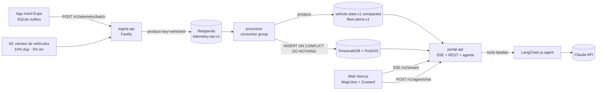

# Opción A · “TypeScript Fast Track” — microservicios TS sobre un mismo monorepo

> Máxima velocidad de entrega y contratos compartidos sin traducción. Todo el backend en
> TypeScript (Fastify + arquitectura hexagonal), Redpanda como bus Kafka-compatible,
> TimescaleDB + PostGIS como persistencia, LangChain.js para el agente.

## Arquitectura

| Pieza | Tecnología |
|---|---|
| Servicios | Node 22 + Fastify, hexagonal (`domain/ application/ adapters/`) — 3 procesos: `ingest-api`, `processor`, `portal-api` |
| Bus | Redpanda (API Kafka, 1 contenedor, sin ZooKeeper) · cliente `@confluentinc/kafka-javascript` |
| Persistencia | TimescaleDB (hypertable `telemetry_points`, compresión > 7 d, retención 90 d, *continuous aggregate* 1 min) + PostGIS para zonas |
| Circuit breakers | `opossum`: ingest→Redpanda (abierto ⇒ 503 + `Retry-After`, el móvil conserva su cola), processor→DB (abierto ⇒ pausa particiones, no commitea), portal-api→LLM (abierto ⇒ fallback determinista) |
| Agente | LangChain.js `createAgent` + tools zod: `get_stopped_vehicles`, `get_vehicle`, `list_active_alerts`, `list_zones`, `get_track` |
| Web (S4) | Next.js App Router + MapLibre + Tailwind + **Zustand** (`subscribeWithSelector`) |
| Móvil (S5) | Expo dev build + expo-location + expo-sqlite + NetInfo |
| CI/CD móvil | GH Actions → **EAS Build en la nube** (perfil `production`, AAB) → Fastlane `supply` a track `internal` |
| IaC | Terraform: ECS Fargate + MSK Serverless + EC2 Timescale (o Timescale Cloud) + ALB |

## Flujo de datos clave

- `telemetry.raw.v1` (12 particiones, clave `vehicleId` ⇒ orden por vehículo). Producer `acks=all`, idempotente.
- Processor: lote de mensajes → `INSERT … SELECT unnest(...) ON CONFLICT (event_id, recorded_at) DO NOTHING`
  (en hypertables el índice único debe incluir la columna de tiempo) → **commit de offset después** de escribir.
- Estado por vehículo en memoria (cada partición tiene un solo dueño); se reconstruye desde
  `vehicle_state` en rebalanceo. Detección: `speed < 3 km/h` y desplazamiento < 50 m ⇒ `stoppedSince`;
  dentro de zona crítica y > 20 min ⇒ `PROLONGED_STOP_CRITICAL_ZONE` con `alertId = hash(vehicle, zone, stoppedSince)` (idempotente).
- Datos tardíos (sync offline): se persisten siempre; solo mueven el estado “en vivo” si `recordedAt > lastSeenAt`.
- portal-api consume `vehicle.state.v1` / `fleet.alerts.v1` con group id único por instancia (broadcast) y hace fan-out SSE.

## S4 en esta opción

- SSE servido por `portal-api`; Next.js lo expone same-origin con un route handler proxy
  (`app/api/stream/route.ts`, `runtime='nodejs'`, `dynamic='force-dynamic'`, `Cache-Control: no-cache, no-transform`) ⇒ auth por cookie, sin CORS.
- Store Zustand: `applySnapshot`, `applyEvents(batch)`; el mapa se suscribe con `useFleetStore.subscribe` (sin re-render React).

## S5 en esta opción

- Base común sin variaciones. Transporte JSON + `gzip`. Cliente HTTP compartido con tipos de `@fleet/contracts`.

## Evaluación

| ✅ Pros | ⚠️ Contras |
|---|---|
| Un solo lenguaje: contratos zod usados tal cual en *todos* los servicios | No refleja el stack Go/.NET de la empresa |
| Menor tiempo (≈ 8–9 h) y menor riesgo | Node menos convincente como argumento de “alta concurrencia” |
| Debug, tests y tooling uniformes (Vitest en todo) | El evaluador puede verlo como “la opción fácil” |
| Docker Compose liviano (≈ 2,5 GB RAM) | |

**Riesgo principal:** que la narrativa de rendimiento sea débil → mitigar con resultados k6 en el README.
