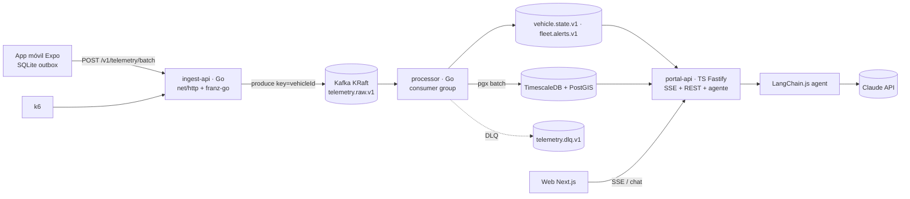

# Opción B · “Políglota alineado al stack corporativo” — Go en el camino caliente, TS en el borde

> El camino de alta concurrencia (ingesta y procesamiento) en **Go**, como la plataforma de la
> empresa; el BFF del portal y el agente en **TypeScript** porque comparten contratos con web y
> móvil. Kafka real (KRaft), TimescaleDB + PostGIS.

## Arquitectura

| Pieza | Tecnología |
|---|---|
| ingest-api | Go 1.23, `net/http` + `chi`, `franz-go` (producer idempotente, `acks=all`), validación con JSON Schema generado desde `@fleet/contracts` (`santhosh-tekuri/jsonschema`) |
| processor | Go, `franz-go` consumer group con commit manual, `pgx` batch, `sony/gobreaker` hacia DB |
| portal-api | TS Fastify: SSE fan-out, REST de lectura, agente LangChain.js, `opossum` hacia LLM y processor |
| Contratos | zod (fuente) → JSON Schema (`z.toJSONSchema`) → validación Go; *golden fixtures* compartidos en tests Go y TS |
| Bus | Apache Kafka 3.x en modo KRaft (1 broker local) + Kafka UI |
| Persistencia | igual que A (hypertable + compresión + retención + continuous aggregates + PostGIS) |
| Web (S4) | Next.js + MapLibre + Tailwind + **hook propio** sobre `useSyncExternalStore` (store externo minimalista, sin dependencia) |
| Móvil (S5) | Expo dev build + expo-location + expo-sqlite + NetInfo |
| CI/CD móvil | GH Actions → **`eas build --local`** en el runner Ubuntu (sin cuota EAS, credenciales EAS) → Fastlane `supply` (internal) ; EAS Update para OTA de JS |
| IaC | Terraform por cuentas (Control Tower: `shared-services`, `workload-dev`, `workload-prod`), ECS Fargate, MSK, ALB con idle timeout ampliado para SSE |

## Por qué Go aquí

- Ingesta = I/O y serialización con miles de conexiones: goroutines + bajo consumo de memoria por request.
- Binarios estáticos de ~15 MB → contenedores `distroless`, arranque < 100 ms (escalado horizontal rápido).
- Benchmarks k6 directamente comparables con lo que la empresa opera.

## S4 en esta opción

- Store propio (≈ 80 líneas): `createFleetStore()` con `getSnapshot/subscribe/dispatch`, reducer puro
  testeable, y `useFleet(selector)` vía `useSyncExternalStore` (seguro con concurrent rendering).
  Argumento: cero dependencias y control total del batching rAF. Contrapartida: mantenemos nosotros
  selectores/igualdad (Zustand ya lo resuelve).
- SSE directo a `portal-api` con CORS + `withCredentials` (o proxy same-origin como en A).

## S5 en esta opción

- Base común. Además: compresión `gzip` del body y header `X-Device-Clock` (`sentAt`) para que
  el ingest calcule *clock skew* y lo registre (no corrige `recordedAt`, solo lo marca).

## Evaluación

| ✅ Pros | ⚠️ Contras |
|---|---|
| Alineado con Go del stack corporativo → fuerte en la sustentación | Dos toolchains (Go + TS), CI más largo |
| Mejor relato de concurrencia/resiliencia (gobreaker, franz-go, pgx) | Contratos vía JSON Schema: un paso de generación más |
| Agente y SSE siguen en TS, compartiendo tipos con la web | ≈ 10–11 h de esfuerzo |
| `eas build --local` evita colas/cuotas del plan gratuito de EAS | Kafka real pesa más en local (≈ 4 GB RAM) |

**Riesgo principal:** deriva de contratos Go↔TS → mitigado con *golden fixtures* y un job de CI que
regenera los JSON Schema y falla si hay diff.
