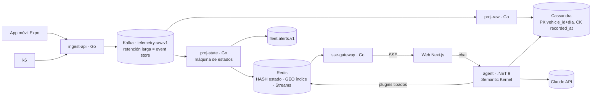

# Opción C · “CQRS + Event Sourcing” — Kafka como fuente de verdad, proyecciones especializadas

> Kafka es el log inmutable; todo lo demás son **proyecciones** reconstruibles. Escritura de alta
> frecuencia en **Cassandra**, estado actual y geobúsqueda en **Redis**, agente en **.NET
> Semantic Kernel**. Máxima escalabilidad y relato arquitectónico, mayor complejidad.

## Arquitectura

| Pieza | Tecnología |
|---|---|
| Event store | Kafka con retención de 7–30 d; *replay* para reconstruir cualquier proyección |
| Historial | Cassandra: `PRIMARY KEY ((vehicle_id, day), recorded_at, event_id)` — escritura idempotente natural (upsert por clave) |
| Estado actual | Redis: `HSET vehicle:{id}`, `GEOADD fleet:pos`, `GEOSEARCH` para “cerca de / dentro de radio”, Redis Streams para fan-out SSE |
| Proyecciones | Go, una por read-model, offsets propios ⇒ se pueden rebobinar independientemente |
| Agente | .NET 9 + Semantic Kernel, plugins `[KernelFunction]` tipados, Polly (circuit breaker + retry + timeout) |
| SSE | `sse-gateway` Go leyendo Redis Streams (`XREAD` con id ⇒ `Last-Event-ID` nativo) |
| Contratos | zod → JSON Schema → Go y C# (NJsonSchema genera DTOs) |
| Web (S4) | Next.js + MapLibre + Tailwind + Zustand |
| Móvil (S5) | Expo dev build + expo-location + expo-sqlite + NetInfo |
| CI/CD móvil | GH Actions → EAS Build nube → **`eas submit`** para Play internal + Fastlane para metadata/promoción de track |
| IaC | AWS CDK (TypeScript): MSK, Amazon Keyspaces (Cassandra gestionado), ElastiCache, ECS |

## S4 en esta opción

- `Last-Event-ID` se mapea 1:1 al id de Redis Streams → reanudación exacta sin snapshot (salvo trim del stream).
- Consultas geoespaciales de la UI (“vehículos en radio”) resueltas por `GEOSEARCH` en el gateway.

## S5 en esta opción

- Base común. El ack del ingest significa “durable en Kafka” (el event store), coherente con ES.

## Evaluación

| ✅ Pros | ⚠️ Contras |
|---|---|
| Relato de arquitectura más sofisticado (CQRS/ES, replay, read-models) | **Excede 8–12 h** (≈ 14–16 h): 3 lenguajes, 3 almacenes |
| Cassandra escala escritura lineal; usa tecnología del stack corporativo | Cassandra no hace consultas ad-hoc: el agente pierde flexibilidad; zonas poligonales sin PostGIS |
| Proyecciones reconstruibles = gran demo de resiliencia | Docker Compose pesado (≈ 6–8 GB RAM: Kafka + Cassandra + Redis) |
| Semantic Kernel/.NET alinea con C# del stack | Más superficie para bugs generados por IA, menos tiempo para auditarlos |

**Riesgo principal:** no terminar. Mitigación posible: Cassandra solo en IaC y mock local con
ScyllaDB, justificándolo como decisión de recursos (la prueba lo permite).
