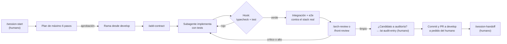

# Entorno agéntico

Este documento describe cómo está montado el desarrollo con IA en este repo y por qué. La meta no es generar código rápido, sino código que pase una revisión de arquitectura senior. Por eso cada pieza existe para que un error de la IA se detecte antes de llegar a `develop`.

## Capas de contexto

| Archivo | Qué contiene |
|---|---|
| `CLAUDE.md` (raíz) | Invariantes no negociables: Clean Architecture, contratos, multi-tenant, idempotencia, Kafka, DLQ, SSE, agente IA, resiliencia, SQL, tiempo y geografía, privacidad y tests obligatorios. También el flujo de ramas y de trabajo. |
| `apps/web/CLAUDE.md`, `apps/mobile/CLAUDE.md`, `infra/CLAUDE.md` | El "cómo" de cada área. No repiten la raíz. |
| `.claude/agents/*.md` | Rol, límites, checklist y formato de resumen de cada subagente. |
| `docs/PLAN.md` | El plan por fases aprobado, con trazabilidad de requisitos. |
| `docs/PROGRESS.md` | El estado entre sesiones. Lo escribe `/session-handoff`. |
| `AGENTS.md` | Bloque que gestiona Turborepo: obliga a consultar la documentación de la versión instalada antes de tocar su configuración. |

## Roles

La sesión principal es el **orquestador**: planea, delega, lee los resúmenes de los subagentes y redacta la documentación. El código de la aplicación lo escriben los subagentes del área, y lo revisan otros que no pueden editarlo.

| Subagente | Rol | Modelo | ¿Edita? |
|---|---|---|---|
| `backend-engineer` | `services/*`, `packages/*` y migraciones | sonnet | Sí |
| `web-engineer` | `apps/web` | sonnet | Sí |
| `mobile-engineer` | `apps/mobile` | sonnet | Sí |
| `devops-engineer` | `infra/`, `.github/` y k6; nunca despliega | sonnet | Sí |
| `architect-reviewer` | Revisa el backend contra `CLAUDE.md` | opus | No |
| `frontend-reviewer` | Revisa web y móvil, incluida la fidelidad al diseño | opus | No |
| `qa-verifier` | Verifica de punta a punta con evidencia | sonnet | No |

Los revisores corren en un modelo más capaz que los implementadores y solo tienen herramientas de lectura. La separación es deliberada: quien escribe el código no lo aprueba.

## Skills

| Skill | Qué hace | Quién la invoca |
|---|---|---|
| `/session-start` | Carga el estado y propone el plan de la sesión | Solo el humano |
| `/session-handoff` | Actualiza `docs/PROGRESS.md` | Solo el humano |
| `/ai-audit-entry` | Registra una corrección a la IA en `docs/AI_AUDIT_LOG.md` | Solo el humano |
| `/add-contract` | Cambia `@fleet/contracts` y propaga el cambio con compatibilidad | Orquestador |
| `/new-usecase` | Caso de uso con Clean Architecture y test primero (corre en `backend-engineer`) | Orquestador |
| `/arch-review` | Revisión de backend de los cambios o de la rama contra `develop` (corre en `architect-reviewer`) | Orquestador |
| `/front-review` | Revisión de web y móvil (corre en `frontend-reviewer`) | Orquestador |
| `/e2e-check` | Verificación de punta a punta del pipeline (corre en `qa-verifier`) | Orquestador |

Las tres skills del humano llevan `disable-model-invocation: true`: abrir o cerrar una sesión y declarar que la IA se equivocó son decisiones humanas. El orquestador las propone en el momento justo, pero no las ejecuta.

Las skills de revisión y verificación corren en un contexto aislado (`context: fork`) con su subagente, de modo que el revisor no hereda las justificaciones del implementador.

## Hook de verificación

`tools/hooks/verify-affected.mjs` corre en `Stop` y `SubagentStop`:

- Detecta los paquetes del monorepo con cambios sin commitear y corre `turbo run typecheck test --filter=...<paquete>`, que cubre el paquete y los que dependen de él.
- Si falla, sale con código 2. Claude Code bloquea el cierre del turno o del subagente y le devuelve el error para que corrija la causa real, sin saltar tests ni debilitar aserciones.
- Guarda una huella del código verificado: si nada cambió desde la última corrida en verde, no repite.
- Tras 3 bloqueos seguidos deja cerrar, pero exige que el resumen diga "tarea NO terminada".
- No corre para los subagentes de solo lectura, ni cuando todavía no existe el monorepo.

**Por qué:** el modo de falla más común de un agente es declarar una tarea terminada sin haber corrido nada, o con tests rojos. El hook vuelve mecánica esa verificación, en vez de depender de que el agente se acuerde.

**Verificado** el 2026-10-04 en Windows, con pnpm 12.9 y Turborepo:
1. Se agregó un test que fallaba a propósito en un archivo nuevo, `packages/contracts/src/hook-probe.test.ts` (`expect(1).toBe(2)`).
2. Invocado a mano, el hook salió con código 2 y nombró los paquetes afectados, el comando y el fallo exacto (`hook-probe.test.ts:5`, `expected 1 to be 2`).
3. Después se cerró un turno real del orquestador con ese test en el árbol. Claude Code bloqueó el cierre y le devolvió la salida del hook.
4. Se borró el archivo y la verificación volvió a verde.

## Permisos

`.claude/settings.json` define tres niveles:

- **Permitido sin preguntar:** comandos de verificación sin efectos secundarios, como typecheck, lint, test y build; `docker compose ps`, `up`, `logs` y `restart`; `psql` con el usuario de solo lectura `fleet_ro`; `rpk` de lectura; `curl` a `localhost`; `git` de lectura; `terraform fmt` y `validate`; `k6 run`.
- **Pregunta al humano:** agregar o quitar dependencias, editar cualquier `package.json`, `tools/`, `.github/workflows/` o `.claude/`, cualquier escritura de `git` (`add`, `commit`, `push`, cambio de rama, `merge`, `rebase` y `stash`), `docker compose down`, `terraform init` y `plan`, y `aws`.
- **Prohibido:**
  - borrar datos o historia: `docker compose down -v`, `docker volume rm`, `git push --force`, `git reset --hard` y `git clean -f`;
  - desplegar: `terraform apply` y `destroy`, `eas submit` y `fastlane`;
  - leer secretos: `.env`, `*.tfstate`, `*.tfvars`, llaves, `~/.aws` y `~/.ssh`;
  - ejecutar código remoto: `npx` y `pnpm dlx`.

**Por qué:** lo que no se puede deshacer o sale del equipo queda fuera del alcance de la IA. Lo que cambia la superficie del proyecto (dependencias, CI, el propio entorno agéntico) pasa por el humano.

## Ciclo de trabajo

- **Ramas:** `master` solo recibe `develop` al cerrar una fase con `/e2e-check` en `LISTO`.
- **Commits:** Conventional Commits, uno por cambio lógico, y solo a pedido del humano.
- **Auditoría de IA:** cuando un revisor marca un hallazgo como "¿Candidato a auditoría IA?: sí", el orquestador propone `/ai-audit-entry`. El registro vive en `docs/AI_AUDIT_LOG.md` y solo contiene casos reales.

## Limitaciones conocidas

- **El agente LLM no es determinista.** En `/e2e-check`, una falla del agente se reintenta una vez; si pasa al segundo intento, se marca como ⚠️ flaky en vez de ocultarla.
- **En Windows, PowerShell está denegado a propósito.** Todo corre en Git Bash, para que los comandos sean los mismos que en CI.
- **El hook asume un solo agente editando a la vez.** Lee `git status` de todo el árbol de trabajo, así que si un subagente edita en segundo plano, el cierre de otro agente, o el del orquestador, verifica ese código a medio escribir y bloquea a quien no corresponde. Además, toma la raíz de `CLAUDE_PROJECT_DIR`, que en un worktree aislado puede no ser el árbol del agente.
  - **Mitigación actual:** los implementadores corren en secuencia, nunca dos a la vez en el mismo árbol.
  - **Pendiente antes de paralelizar las fases 2, 3 y 4a:** que el hook use la raíz git del `cwd` del agente, y que cada implementador paralelo trabaje en su propio worktree.
